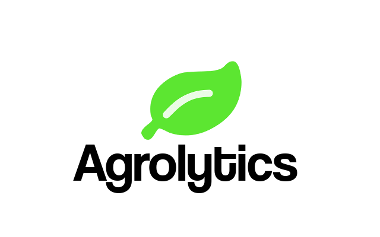
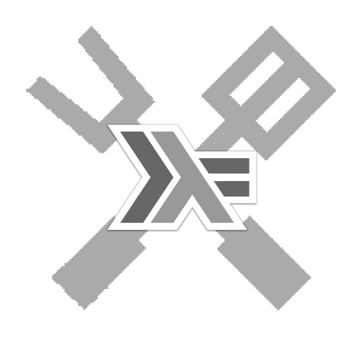

  

# Agrolytics - Gerenciamento remoto de campos de cultivo

Ferramenta de monitoramento destinado ao agronegócio, utilizando tabelas, gráficos e sensores.

## Estrutura do Projeto:

### Sensores

O usuário poderá ter o controle dos seus sensores instalado em uma lista dos locais instalados, apresentando o seu estado, coordenadas e mapa.

### Gráficos

O Sistema disponibiliza gráficos a partir dos dados coletados dos sensores, apresentando tabelas do dia, semana e até um mês. 

### Clima

Uma opção de verificação de clima é disponibilizado contendo informações do tempo, como temperatura, umidade e iluminosidade das cidades cadastradas do usuário.

### Interface

A interface foi desenvolvida usando recursos web, como HTML5, Javascript e CSS3. Como base de framework, foi usado o Bootstrap.
O template Gentella faz parte de algumas implementações do Agrolytics.

## Recursos utilizados

O projeto destina-se a ser uma aplicação web responsivo, desenvolvido por meio da utilização do framework web [Django](https://www.djangoproject.com/), em sua versão 2.0.6.

Informações obtidas do portal foram capturadas a partir da API Openweathermap(https://openweathermap.org), no qual forneceu dados do clima e tempo de qualquer região e em até 5 dias a frente.

## Monetização

Para a geração de receita por meio da aplicação optou-se uma mensalidade para cada cliente.

**Requisitos**:

 * Django 2.0
 * Python >= 3
 
<h3>Projeto desenvolvido pela equipe Chuhaskell</h3>

  

